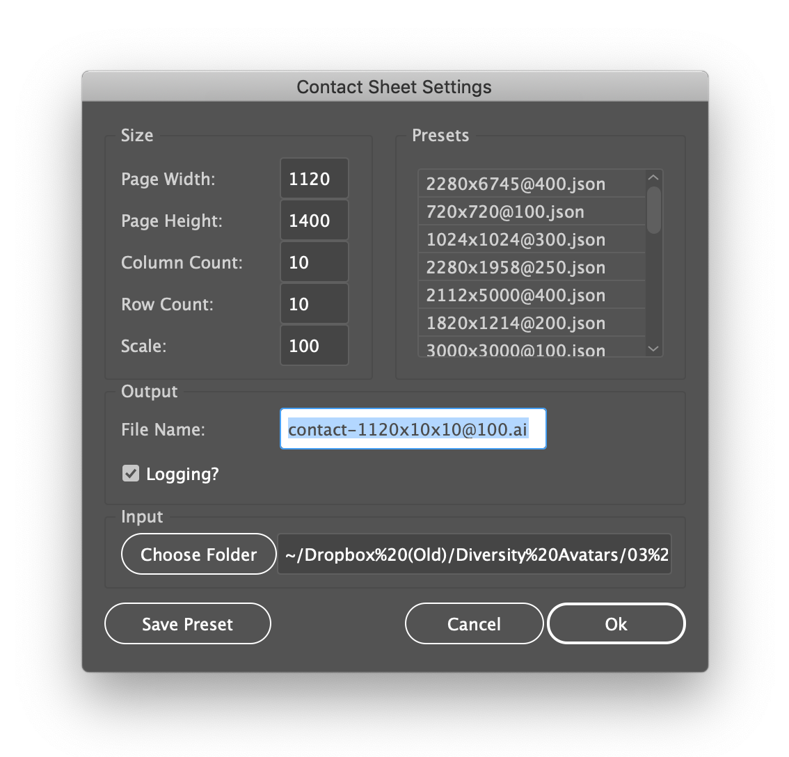
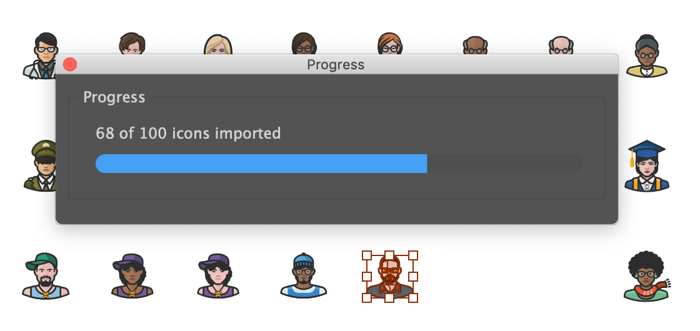

# Contact Sheet

A JavaScript extension for Adobe Illustrator to create a contact sheet from a folder of SVG files. The script allows you select a folder of SVG files and imports and arranges them in a grid pattern as a contact sheet. You can specify the page width and height, number of columns and rows, and the scale of the imported files.

***
#### Support Open Source Development

Donations help open source developers, who are often self-employed freelancers, continue to create free resources. You can donate to this project using the button below.

***

## Installation

To use this script, you will need to copy the entire <strong>Contact Sheet</strong> folder to your Illustrator scripts folder, then restart Illustrator. Follow the steps below to install.

1. Unzip the <strong>Contact Sheet</strong> ZIP archive.
2. Copy the <strong>Contact Sheet</strong> folder to <em>Adobe Illlustrator/Presets/{language}/Scripts/</em> where {language} is your chosen language. For example, if you have a US version of Illustrator this will be `en_US`.
3. Restart Illustrator
4. Once Illustrator restarts, verify that the script was installed by going to <em>File &gt; Scripts &gt; Contact Sheet</em>

## Usage

> Go to <em>File &gt; Scripts &gt; Contact Sheet</em> to launch the script. You will see a dialog like the one below.

> <strong>Contact Sheet</strong> creates a single artboard, imports a folder of SVG files you specify, and arranges them in a grid. Using the dialog inputs, specify the page width and height, the number of columns and rows, the scale of the imports (from 1 to 100 - do not include the percent sign). Once you have the values you want, you can click the <em>Save Preset</em> button to save these settings for future use.

> Click the <em>Choose Folder</em> button to select your folder of SVG files (<em>NOTE: Contact Sheet was created to create previews of icon sets so for now it only works with SVG files</em>).

> Double-check your settings and click <em>Ok</em>. <strong>Contact Sheet</strong> will display a progress dialog to let you know how many files are left to import. Once the files are imported and arranged, the file will be saved to the name you specified.

> If you checked the <em>Logging?</em> checkbox, you can view the log file in <em>/your-home-folder/ai-contact-sheet</em> where <em>~/</em>. For example, on a Mac the folder can be found at <em>/Users/yourname/ai-contact-sheet/</em> (or <em>~/ai-contact-sheet/</em> for shorthand). The preset configuration files can also be found in this location.

### Custom Configuration

<strong>NOTE</strong> : changing the default configuration can break the <strong>Contact Sheet</strong> utility. Proceed with caution.

You can change many of the default settings such as the location of the presets and log files, Illustrator version compatibility, etc.

## Disclaimer of Liability

This script is offered AS-IS without any warranty or guarantees of any kind. You use this script completely at your own risk and under no circumstances will the developer and/or distributor of this script be held liable for damages of any kind including loss of data or damage to hardware or software. If you do not agree to these terms, do not use this script.

## Credits

You are free to use, modify, and distribute this script as you see fit as long as you maintain the copyright notices in the original source files. A link to the Atomic Lotus website would be appreciated as well. You must also extend the same license to users of your code. This is not to say that your original code must be open source, but the code from this project must remain free and open forever.

Attribution:

Resize Artboards by: 
Scott Lewis &lt;scott@atomiclotus.net&gt; 
https://atomiclotus.net